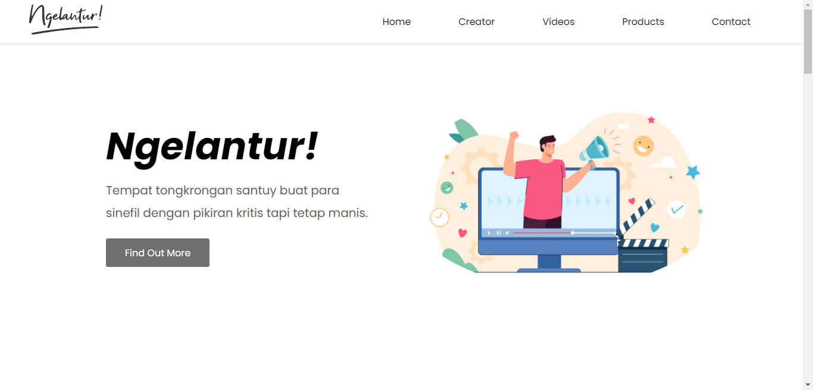
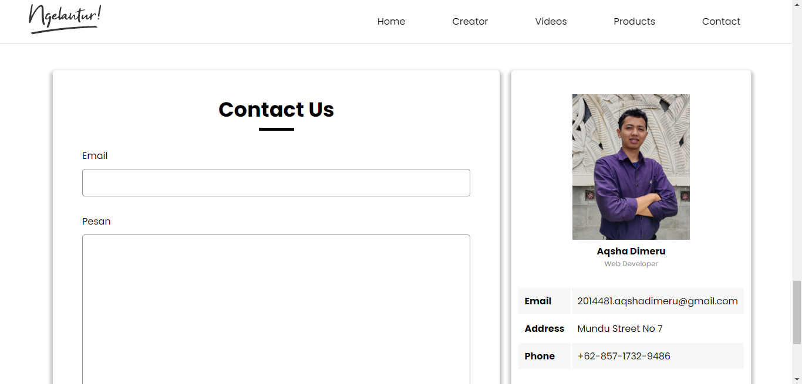

# **Ngelantur Website**

## 🎯 **Project Description**

This is the first website project I've created entirely by my own. I made this project to finish my Basic Web Course by Dicoding 🚀.
I only used HTML CSS for this project to learn the structure of HTML and the nature of CSS. 
The idea of this website is to show my favorite YouTube channel profile. This website consists of 5 sections:

* **Home** 🏠 => Displays the main page of the website showing Ngelantur title, jargon, and art banner

* **Creator** 👨 => Displays the creator of the channel, the creator image, and a little description about him

* **Videos** 📽 => Displays some of the videos from Ngelantur Indonesia channel

* **Products** 👕 => Displays the original products of Ngelantur Indonesia

*  **Contact** 📞 => Displays the website maker contact form and the profile of website maker

## 📸 **Website Preview**

